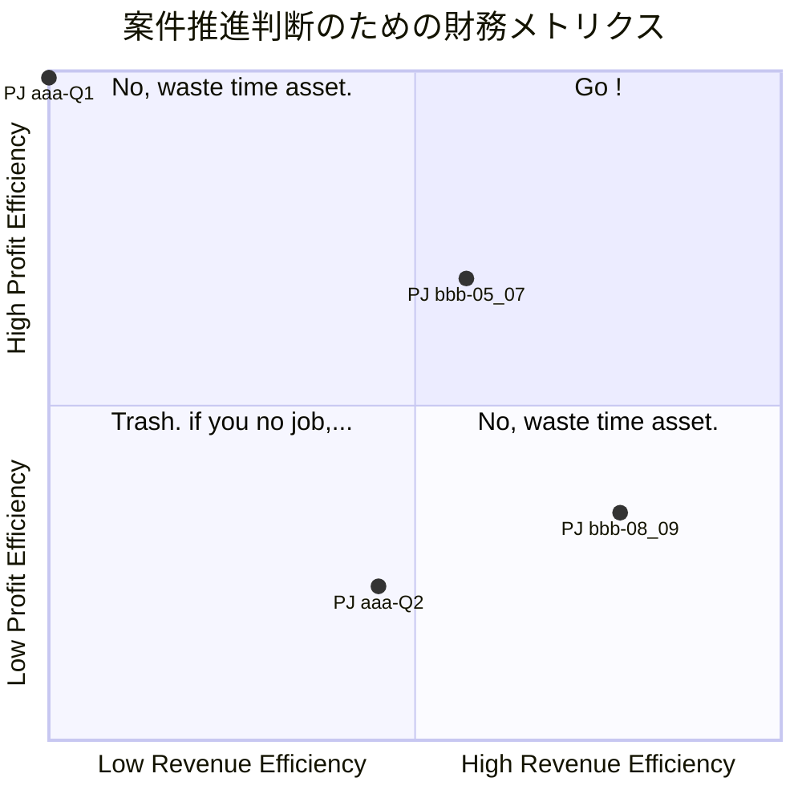

```mermaid

quadrantChart
    title 案件推進判断のための財務メトリクス

    x-axis Low Revenue Efficiency --> High Revenue Efficiency
    y-axis Low Profit Efficiency  --> High Profit Efficiency 

    quadrant-1 Go !
    quadrant-2 No, waste time asset.
    quadrant-3 Trash. if you no job,...
    quadrant-4 No, waste time asset.

    PJ aaa-Q1:      [0.0, 0.99]
    PJ aaa-Q2:      [0.45, 0.23]
    PJ bbb-05_07:   [0.57, 0.69]
    PJ bbb-08_09:   [0.78, 0.34]
```